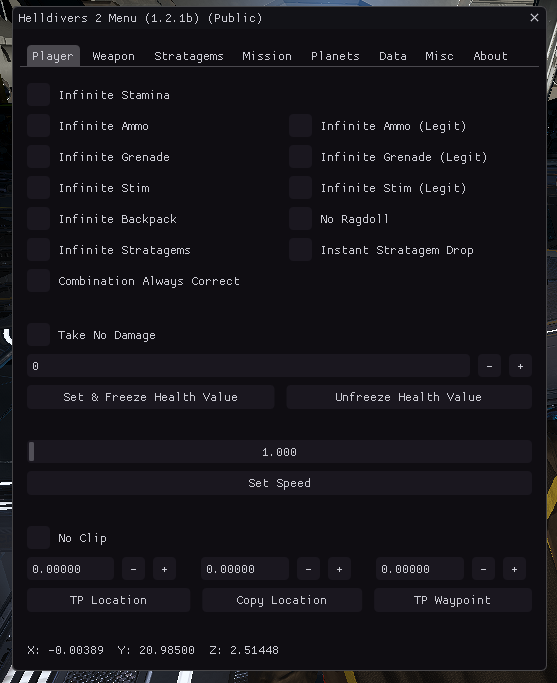
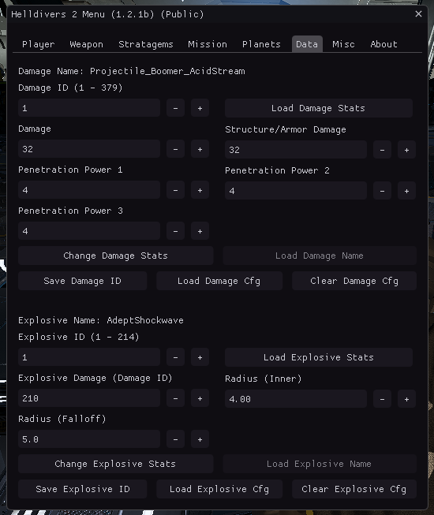

# Helldivers2 Public Menu

### Compile Instruction
1) Download and compile Minhook then put `libMinHook.x64.lib` in `libs/MinHook/libMinHook.x64.lib`
2) Build the project as `helldiver2_public`

### Screenshots

### Credits
- Destinate/SquadZLeader (myself)
- emoisback
- gir489
- cfemen
- void*
- ZoDDeL
- Exitium
- SleepyCatto
- chris11
- killekrok555
- impushingp
- Kanna
- Erik9631
- NuLLxD
